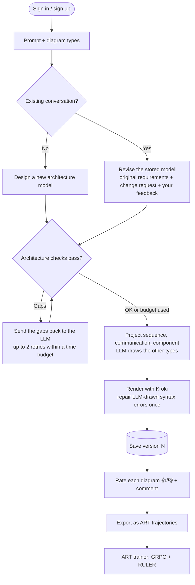
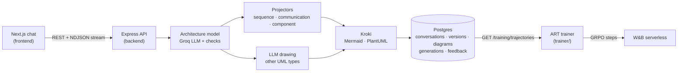

# 📐 UML Chat

A chat-based architecture assistant. Describe a software system in plain language, pick the UML diagram types you need, and get rendered, consistent **UML 2.x diagrams**. Follow-up messages revise the same design as a new version, and your 👍/👎 ratings feed a reinforcement-learning trainer built on **LangChain ART**.

---

## 🌟 Highlights

- **🧠 One architecture model per version.** Every generation first builds, or revises, a validated architecture model: elements, interactions, layers and replies. All diagrams in the version are drawn from it, so they describe the same system.
- **📐 Consistent by construction.** Sequence, communication and component diagrams are drawn by code from the model, so they always show the same elements under the same names. The other UML types are drawn by the LLM, using the model's names.
- **✅ Architecture checks before drawing.** The model is checked in code for:
  - a causal flow;
  - datastores that are both written and read;
  - a scheduler for monitoring use cases;
  - orchestrated steps that report their outcome;
  - external sources that are modelled;
  - an "only new items" step.

  Gaps go back to the LLM for a fix.
- **🛡️ Validated end to end.** Strict Zod schemas guard every request and every LLM reply. Kroki renders each diagram, and LLM-drawn diagrams with syntax errors get one automatic repair.
- **🔄 Multi-turn revisions.** Follow-ups revise the stored model. They also carry the original requirements and your feedback on the previous version.
- **📡 Live progress.** Generation streams its steps and the model's reasoning to the chat as they happen.
- **🖼️ Diagram viewer.** Zoom and pan, fit to screen, copy the source, download SVG/PNG.
- **🎯 Feedback → RL.** Ratings and comments are stored with the exact LLM exchange that produced each diagram. They're exported as ART trajectories, and the trainer in `trainer/` runs GRPO with a RULER judge on W&B serverless.
- **🔐 Accounts and history.** Email/password sign-in, with a per-user conversation list.

---

## 🗺️ Supported UML 2.x diagram types

| Category | Diagram type | Engine | Drawn by |
| :--- | :--- | :--- | :--- |
| Structure | Class | Mermaid | LLM, from the model |
| Structure | Object | PlantUML | LLM, from the model |
| Structure | **Component** | PlantUML | **Code (projected)** |
| Structure | Composite structure | PlantUML | LLM, from the model |
| Structure | Deployment | PlantUML | LLM, from the model |
| Structure | Package | PlantUML | LLM, from the model |
| Structure | Profile | PlantUML | LLM, from the model |
| Behavior | Use case | PlantUML | LLM, from the model |
| Behavior | Activity | Mermaid | LLM, from the model |
| Behavior | State machine | Mermaid | LLM, from the model |
| Interaction | **Sequence** | Mermaid | **Code (projected)** |
| Interaction | **Communication** | PlantUML | **Code (projected)** |
| Interaction | Interaction overview | PlantUML | LLM, from the model |
| Interaction | Timing | PlantUML | LLM, from the model |

Loose names are accepted and normalised, e.g. `"sequential"`, `"use-case"` or `"state"`.

---

## 🔄 How a conversation works



1. **New conversation.** Your prompt becomes the requirements. The backend designs an architecture model, checks it, draws every requested diagram and saves version 1.
2. **Follow-up.** The stored model is revised rather than rebuilt. The original requirements, your change request and your ratings on the previous version all go into the prompt.
3. **Feedback.** Each diagram can be rated with an optional comment. Ratings steer the next revision immediately and are exported for RL training.

---

## 🏗️ System architecture



---

## ✅ How consistency is enforced

| Layer | What it guarantees |
| :--- | :--- |
| **Model schema** (Zod) | Unique identifier names, interactions between known elements, every element in at least one interaction |
| **Architecture checks** (`backend/src/services/consistency.ts`) | Causal flow, replies via `returns`, each datastore written and read, a non-human trigger for monitoring, orchestrated steps return outcomes, external sources modelled, an "only new items" step |
| **Projectors** (`backend/src/services/projection.ts`) | Sequence, communication and component views contain exactly the model's elements. Replies follow the callee's work; lifelines follow the flow |
| **Update check** | A follow-up that returns identical LLM-drawn diagrams is sent back |
| **Kroki render + repair** | Only valid syntax is shown. LLM-drawn diagrams get one repair; projected ones never drift |

Issues that remain after the retry budget is used up are saved with the generation, not silently dropped.

---

## 💻 Tech stack

**Frontend (`frontend/`)**
- Next.js 16 (App Router), React 19, TypeScript, Tailwind CSS v4
- Feature-Sliced Design, checked with Steiger
- Zod for every request and response
- Vitest + Testing Library, Playwright

**Backend (`backend/`)**
- Node.js, Express 5, TypeScript (ESM); controller → service → repository
- PostgreSQL (`pg`), plain SQL migrations
- Groq SDK (`openai/gpt-oss-120b` by default) in JSON mode, with streaming reasoning
- Zod 4 as a strict validator for requests, LLM replies and the architecture model
- Vitest + Supertest

**Trainer (`trainer/`)**
- Python 3.12, uv
- OpenPipe ART (`openpipe-art[langgraph]`), RULER judge through LiteLLM
- W&B serverless training, pytest

**Infrastructure**
- Docker Compose: Postgres 17 and Kroki (PlantUML built in, plus the Mermaid and Excalidraw companions)
- A separate [BMAD Method](https://github.com/bmad-code-org/BMAD-METHOD) install in each app folder

---

## 📁 Repository structure

```
uml-diagram-webapp/
├── docker-compose.yml          # Postgres 17 + Kroki (+ Mermaid, Excalidraw)
├── frontend/                   # Next.js app, Feature-Sliced Design
│   └── src/
│       ├── app/                # routes, global styles
│       ├── pages/chat/         # chat workspace, thread, conversation sidebar
│       ├── features/           # auth, generate-diagrams (streaming), rate-diagram
│       ├── entities/           # diagram (card, viewer, export), conversation, user
│       └── shared/             # API client (JSON + NDJSON stream), config, session
├── backend/                    # Express API
│   ├── migrations/             # 001 … 006 SQL migrations
│   └── src/
│       ├── controllers/        # HTTP layer (generate streams NDJSON on request)
│       ├── services/           # llm, consistency checks, projection, kroki, training
│       ├── repositories/       # SQL access
│       ├── schemas/            # Zod: requests, diagrams, architecture model, training
│       └── middlewares/        # auth, validation, errors
└── trainer/                    # ART trainer (uv project)
    └── src/uml_trainer/        # export client, scenarios, rollout, scoring, pipeline, CLI
```

Each app is independent: its own dependencies, lockfile, env file and BMAD install (`_bmad/`, `.claude/skills/`). Open each folder on its own when you work with BMAD agents.

---

## 🚀 Getting started

### Prerequisites
- Node.js 20+ and npm
- Docker (for Postgres and Kroki)
- A Groq API key from [console.groq.com](https://console.groq.com/keys)
- For the trainer: [uv](https://docs.astral.sh/uv/) and a W&B API key

### 1. Infrastructure

```bash
docker compose up -d          # Postgres :5432, Kroki :8000
```

### 2. Backend

```bash
cd backend
cp .env.example .env          # set GROQ_API_KEY (and TRAINING_API_TOKEN for the trainer)
npm install
npm run db:migrate
npm run dev                   # http://localhost:4000/api/health
```

### 3. Frontend

```bash
cd frontend
cp .env.example .env.local    # NEXT_PUBLIC_API_URL=http://localhost:4000/api
npm install
npm run dev                   # http://localhost:3000
```

### 4. Trainer (optional)

```bash
cd trainer
cp .env.example .env          # TRAINING_API_TOKEN (same as backend), WANDB_API_KEY, GROQ_API_KEY
uv sync
uv run uml-trainer --dry-run  # pull and score, no paid calls
uv run uml-trainer            # one training step (paid)
```

---

## ⚙️ Configuration (backend `.env`)

| Variable | Default | Purpose |
| :--- | :--- | :--- |
| `DATABASE_URL` | — | Postgres connection string |
| `KROKI_URL` | `http://localhost:8000` | Diagram renderer |
| `GROQ_API_KEY` | empty | LLM key; generation returns 503 until it's set |
| `GROQ_MODEL` | `openai/gpt-oss-120b` | Model for all LLM calls |
| `GROQ_REASONING_EFFORT` | `low` | Reasoning depth for diagram and repair calls |
| `GROQ_ARCHITECTURE_REASONING_EFFORT` | `medium` | Reasoning depth for the architecture call |
| `LLM_SOFT_RETRY_BUDGET_MS` | `15000` | Stop retrying check failures after this long |
| `TRAINING_API_TOKEN` | empty | Bearer token for the export API (32+ chars); export returns 503 while unset |
| `SESSION_TTL_DAYS` | `30` | Login lifetime |
| `CORS_ORIGIN` | `http://localhost:3000` | Allowed frontend origin(s) |

On Groq's free tier (8k tokens per minute), set `GROQ_ARCHITECTURE_REASONING_EFFORT=low` if retries hit the rate limit.

---

## 🧪 Testing

```bash
# backend
cd backend && npm run typecheck && npm test

# frontend
cd frontend && npm run typecheck && npm run lint && npm run lint:fsd && npm test
npx playwright test           # E2E; the full-stack spec makes a real Groq call

# trainer
cd trainer && uv run pytest && uv run ruff check
```

---

## 📡 API reference

All routes are under `/api`. Routes marked 🔒 need `Authorization: Bearer <session token>`.

**Health and auth**
- `GET /health`: database, Kroki and LLM-key status.
- `POST /auth/signup`, `POST /auth/login`: `{ email, password }` → `{ token, user }`.
- `POST /auth/logout` 🔒, `GET /auth/me` 🔒.

**Diagrams and conversations**
- `POST /diagrams/generate` 🔒: `{ prompt, diagram_types[], conversation_id? }` → `{ conversation_id, version, diagrams[] }`.
  - Without `conversation_id` it starts a new conversation; with one, it creates the next version.
  - Send `Accept: application/x-ndjson` to stream `progress` and `thinking` lines, followed by a final `result` (or `error`) line.
- `POST /diagrams/:id/feedback` 🔒: `{ rating: 1 | -1, comment? }`. One rating per user per diagram; rating again replaces it.
- `GET /conversations` 🔒: your conversations, most recently updated first.
- `GET /conversations/:id` 🔒: every version with its diagrams.

**Training export** (needs `Authorization: Bearer <TRAINING_API_TOKEN>`)
- `GET /training/trajectories?limit=&kind=diagrams|architecture`: NDJSON, one `art.Trajectory` per line. The `X-Export-As-Of` header must be echoed on ack.
- `POST /training/trajectories/ack`: `{ ids[], as_of }`. Marks lines as trained; newer feedback makes them exportable again.

---

## 🧠 Feedback and reinforcement learning (ART)

Every generation stores the exact system prompt, user prompt and accepted reply of each LLM call: the architecture model, and the diagram drawing when the LLM drew any. Ratings attach to individual diagrams.

| Export kind | Scored from | Reward per diagram |
| :--- | :--- | :--- |
| `diagrams` (default) | LLM-drawn diagrams only | −1 if it didn't render or needed repair, else the rating (unrated = 0) |
| `architecture` | All diagrams in the version | The rating (unrated = 0) |

A trajectory's reward is the mean over its diagrams. The trainer's pipeline:

1. Pull rated trajectories, 👎 first.
2. Run N on-policy rollouts per prompt.
3. Score each rollout: 0 for invalid output, otherwise `0.5 · Kroki render rate + 0.5 · RULER`. The RULER rubric includes your comments verbatim.
4. Train a GRPO step on W&B serverless.
5. Acknowledge only the lines it actually trained on.

See `trainer/README.md` and `trainer/_bmad-output/specs/` for the reward design.

Two gaps remain:
- The trainer reads only `kind=diagrams`. Architecture trajectories are exported but not trained yet.
- The trained checkpoint isn't served back to the app yet.

---

## 📄 More

- `task.md`: the original brief and cases.
- `IMPLEMENTATION-STATUS.md`: what's done and what's left.
- `features.md`: feature notes.
